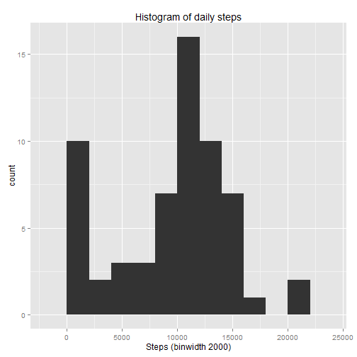
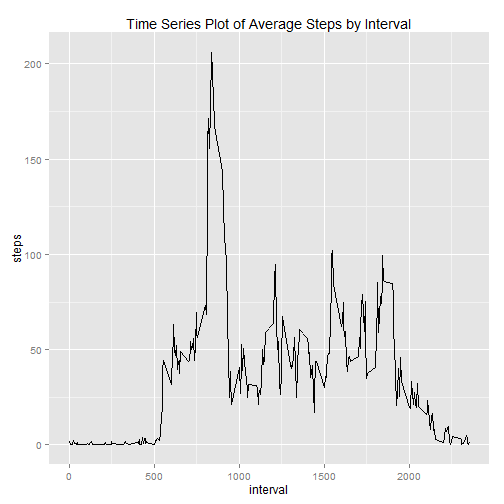
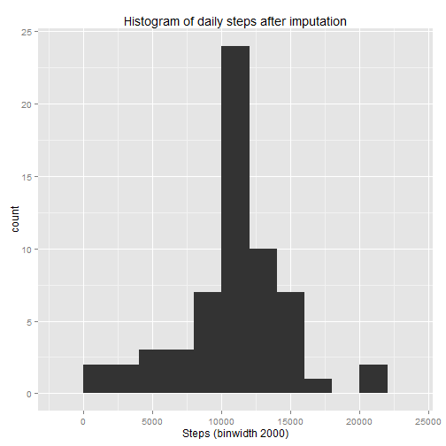
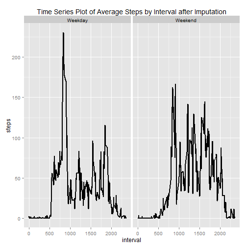

## Loading and preprocessing the data

```r
#Load the data (i.e. read.csv())

df <- read.csv("./repdata-data-activity/activity.csv")
str(df)
```

```
## 'data.frame':	17568 obs. of  3 variables:
##  $ steps   : int  NA NA NA NA NA NA NA NA NA NA ...
##  $ date    : Factor w/ 61 levels "2012-10-01","2012-10-02",..: 1 1 1 1 1 1 1 1 1 1 ...
##  $ interval: int  0 5 10 15 20 25 30 35 40 45 ...
```

```r
head(df)
```

```
##   steps       date interval
## 1    NA 2012-10-01        0
## 2    NA 2012-10-01        5
## 3    NA 2012-10-01       10
## 4    NA 2012-10-01       15
## 5    NA 2012-10-01       20
## 6    NA 2012-10-01       25
```

```r
#Process/transform the data (if necessary) into a format suitable for your analysis
df$date <- as.Date(df$date)
```

## What is mean total number of steps taken per day?

```r
library(ggplot2)
total.steps.by.day <- aggregate(x = df$steps , by = list(df$date), FUN = sum ,na.rm=TRUE)
head(total.steps.by.day)
```

```
##      Group.1     x
## 1 2012-10-01     0
## 2 2012-10-02   126
## 3 2012-10-03 11352
## 4 2012-10-04 12116
## 5 2012-10-05 13294
## 6 2012-10-06 15420
```

```r
names(total.steps.by.day) <- c("date","steps")

hist_plot <- ggplot(total.steps.by.day,aes(x = steps)) +
  ggtitle("Histogram of daily steps") +
  xlab("Steps (binwidth 2000)") +
  geom_histogram(binwidth = 2000)
hist_plot
```

 


```r
#mean total number of steps taken per day
mean(total.steps.by.day$steps , na.rm = TRUE)
```

```
## [1] 9354.23
```

```r
#median total number of steps taken per day
median(total.steps.by.day$steps , na.rm = TRUE)
```

```
## [1] 10395
```


Mean total number of steps taken per day is 9354.2295082 <br>
Median total number of steps taken per day is 10395

## What is the average daily activity pattern?

```r
#Time series plot of 5-minute interval and the average number of steps taken, averaged across all days
average.steps.by.interval  <- aggregate(x = df$steps , by = list(df$interval), FUN = mean ,na.rm=TRUE)
head(average.steps.by.interval)
```

```
##   Group.1         x
## 1       0 1.7169811
## 2       5 0.3396226
## 3      10 0.1320755
## 4      15 0.1509434
## 5      20 0.0754717
## 6      25 2.0943396
```

```r
names(average.steps.by.interval) <- c("interval","steps")

avg.step.line <- ggplot(average.steps.by.interval,aes(interval,steps)) +
  ggtitle("Time Series Plot of Average Steps by Interval") +
  geom_line()
avg.step.line  
```

 


```r
#The 5-min time interval contains the maximum number of steps?
average.steps.by.interval[which.max(average.steps.by.interval$steps),c("interval")]
```

```
## [1] 835
```


The 5-min time interval contains the maximum number of steps is 835

## Imputing missing values

```r
#total number of missing values in the dataset
nrow(df[is.na(df$steps),])
```

```
## [1] 2304
```

```r
#imputing missing step values with mean step at time interval
df.imputed <- merge(x = df, y = average.steps.by.interval, by = "interval", all.x = TRUE)
head(df.imputed)
```

```
##   interval steps.x       date  steps.y
## 1        0      NA 2012-10-01 1.716981
## 2        0       0 2012-11-23 1.716981
## 3        0       0 2012-10-28 1.716981
## 4        0       0 2012-11-06 1.716981
## 5        0       0 2012-11-24 1.716981
## 6        0       0 2012-11-15 1.716981
```

```r
df.imputed[is.na(df.imputed$steps.x),c("steps.x")] <- df.imputed[is.na(df.imputed$steps.x),c("steps.y")]
head(df.imputed)
```

```
##   interval  steps.x       date  steps.y
## 1        0 1.716981 2012-10-01 1.716981
## 2        0 0.000000 2012-11-23 1.716981
## 3        0 0.000000 2012-10-28 1.716981
## 4        0 0.000000 2012-11-06 1.716981
## 5        0 0.000000 2012-11-24 1.716981
## 6        0 0.000000 2012-11-15 1.716981
```

```r
#cleaning data
df.imputed$date <- as.Date(df.imputed$date)
df.imputed$date.x <- NULL
df.imputed$Group.1 <- NULL
df.imputed$steps <- df.imputed$steps.x
df.imputed$steps.x <- NULL
df.imputed$steps.y <- NULL
head(df.imputed)
```

```
##   interval       date    steps
## 1        0 2012-10-01 1.716981
## 2        0 2012-11-23 0.000000
## 3        0 2012-10-28 0.000000
## 4        0 2012-11-06 0.000000
## 5        0 2012-11-24 0.000000
## 6        0 2012-11-15 0.000000
```

```r
#histogram with new dataframe
total.steps.by.day <- aggregate(x = df.imputed$steps , by = list(df.imputed$date), FUN = sum ,na.rm=TRUE)
names(total.steps.by.day) <- c("date","steps")
histplot <- ggplot(total.steps.by.day,aes(x = steps)) +
  ggtitle("Histogram of daily steps after imputation") +
  xlab("Steps (binwidth 2000)") +
  geom_histogram(binwidth = 2000)
histplot
```

 


```r
#mean total number of steps taken per day
mean(total.steps.by.day$steps , na.rm = TRUE)
```

```
## [1] 10766.19
```

```r
#median total number of steps taken per day
median(total.steps.by.day$steps , na.rm = TRUE)
```

```
## [1] 10766.19
```


New mean total number of steps taken per day is 1.0766189 &times; 10<sup>4</sup>  <br>
New median total number of steps taken per day is 1.0766189 &times; 10<sup>4</sup>

## Are there differences in activity patterns between weekdays and weekends?

```r
#Factor variable with two levels indicating a weekday or weekend.
df.imputed$weekday <- as.factor(ifelse(weekdays(df.imputed$date) %in% c("Saturday","Sunday"), "Weekend", "Weekday")) 

average.steps.by.interval.and.weekday  <- aggregate(x = df.imputed$steps , 
                                                    by = list(df.imputed$interval,df.imputed$weekday), FUN = mean ,na.rm=TRUE)
names(average.steps.by.interval.and.weekday) <- c("interval","weekday","steps")

#panel time series plot of the 5-minute interval and the average number of steps taken 
#averaged across all weekday days or weekend days.
avg.step.line <- ggplot(average.steps.by.interval.and.weekday,aes(interval,steps)) +
  ggtitle("Time Series Plot of Average Steps by Interval after Imputation") +
  facet_grid(. ~ weekday) +
  geom_line(size = 1)
avg.step.line  
```

 

